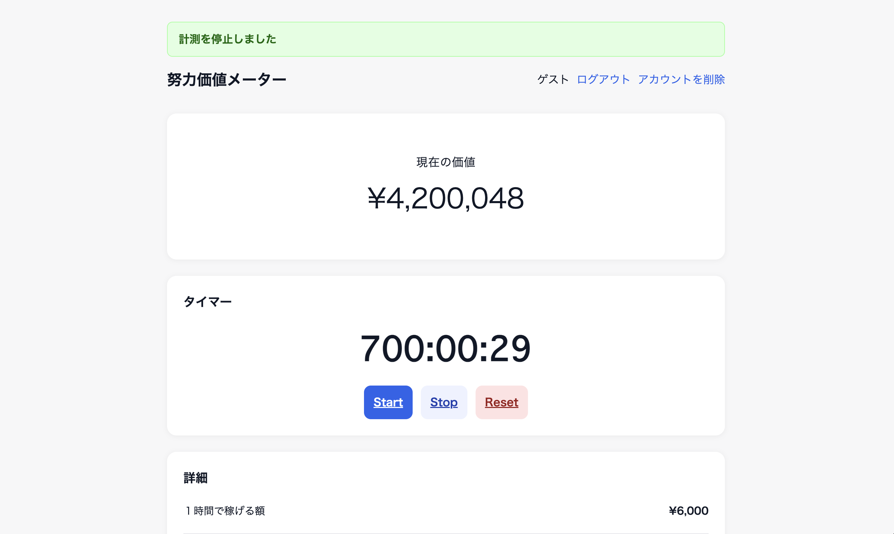

##  ■ はじめに
１つの区切りでしか報酬が得られない努力はたくさんあると思います。 
資格勉強も、年収UPまでの期間も、1日ずつ、１秒ずつ自分の努力は積み重なっているはずなのに、区切りの時期にしか評価が実感できない。 
そこで、１秒ずつの価値が可視化されればモチベーションも保ちやすいのではないかと思いこのアプリを開発しました。 

本リポジトリは、タイマーで努力時間を計測し、現在の努力の価値を金額として可視化できる、シンプルなアプリです。 

##  ■ アプリURL
https://exp-meter.com 
(ゲストIDでログイン可能です) 
■Email: a@gmail.com 
■パスワード: password1

## ■ アプリの使い方
- まずは目標を設定。目標としている金額と、目標達成するまでに費やしたい時間を設定
- タイマースタートで計測が始まります。
- ストップを押すと、経過した時間で、今の自分の努力の価値が計算されます。
- 既にその目標に何時間か費やしていた場合、手入力で、設定した時間から努力を開始することも可能です。

## ■ 特徴・コンセプト、苦労した点、力を入れた点など？意識した点
・できるだけ直感的に使えるように、機能やビューをシンプルにした
・

## ■主な機能
- ユーザー登録・ユーザー削除・ログイン機能
- レスポンシブ対応
- タイマー機能（計測開始・計測停止・リセット機能）
- 現在の価値計算機能
- 目標金額・目標時間の設定機能
- 手動での経過時間変更機能
- 本日稼いだ額の表示機能
- １時間で稼げる額の換算機能

## ■ クラウドアーキテクチャ

## ■ 使用技術 
### バックエンド
- Ruby 3.3.1
- Rails 8.0.2.1
### フロントエンド
- HTML
- CSS
- Javascript
### データベース
- PostgreSQL
### インフラ / デプロイ
- Nginx
- Puma
- CircleCi CI/CD
- AWS
    - VPC
    - EC2s
    - RDS
    - Route53
    - ALB
    - ACM
    - CloudWatch
### その他
- Github(ソースコード管理)

## ■ 開発者
[開発者情報] 
X: https://x.com/p_0_one